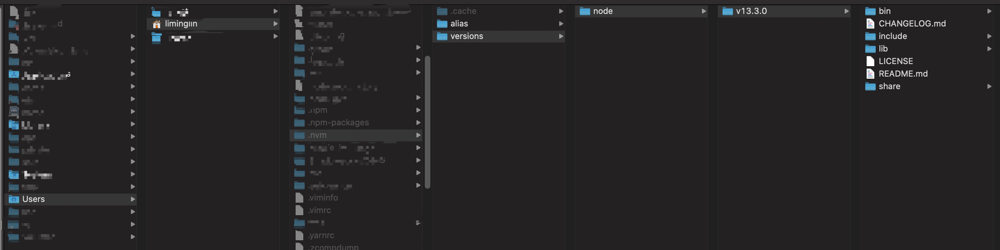

# Mac 安装 npm 的正确方式

### 如果是 window 的话，直接忽略，用安装包安装就行

刚换 mac 的时候，主要的开发工作也没在前端这块，就直接通过 mac 的 brew 进行 node 的安装，几个月之后，想着说安装一个 vuepress 来玩玩博客什么的，发现使用 npm 安装的 vuepress 使用不了，然后运行 npm 的升级命令: `npm install -g npm`，结果是终端上显示执行完成，但执行查看命令依然是一开始的版本，刚开始是想着用 vuepress 但是安装半天一直有问题，后来就安装了 yarn，用是可以用，但是 npm 这个问题，我其他做从事前端开发的朋友竟然是没有的，然后就搜了半天，终于给我发现了这条 [solution](https://gist.github.com/DanHerbert/9520689)... ，由于这提出的时间也比较早，已经有很多网友碰到并且尝试解决，然后发表了新的解决方案，但是本人毕竟也花了挺长时间去解决这个问题，因此通过此篇给大家分享一下，那么我接下来的内容更多的是结合自己的操作以及翻译里面的内容。 这篇内容主要是使用 nvm 这个工具来帮助我们完成 node 的安装，下面来回顾一下整个的操作流程

```text
/**
 * 首先说明一下，上面链接的作者使用的方法不可用了
 * 现在是按网友最新的解决方案执行
 */
 
# 1、将之前用 brew 安装的 node 先卸载掉
rm -rf /usr/local/lib/node_modules
brew uninstall node

# 2、使用 brew 安装 nvm
brew update
brew install nvm

# 3、安装成功后（会有稍长时间等待）
# 需要配置一下 .zshrc（没有就创建一个，目录 ~/）
# .nvm 文件夹需要创建的话也直接创建了（也是在 ~/）
touch ~/.zshrc

# 4、创建后（本来就有这个文件），往里面添加 nvm 的配置
# 直接拷贝就行，我是从 nvm 的 github 找到的
# 添加完之后记得 source 一下
export NVM_DIR="/Users/liminglin/.nvm"
  [ -s "/usr/local/opt/nvm/nvm.sh" ] && . "/usr/local/opt/nvm/nvm.sh"  # This loads nvm
  [ -s "/usr/local/opt/nvm/etc/bash_completion.d/nvm" ] && . "/usr/local/opt/nvm/etc/bash_completion.d/nvm"  # This loads nvm bash_completion
  
# 5、然后使用 nvm 安装 node（完成后升级就👌了）
nvm install node

```

安装完成后，可以看到目录结构如下图，node 目录就会在用户目录中，后续安装的 package 用起来就很舒服了~



